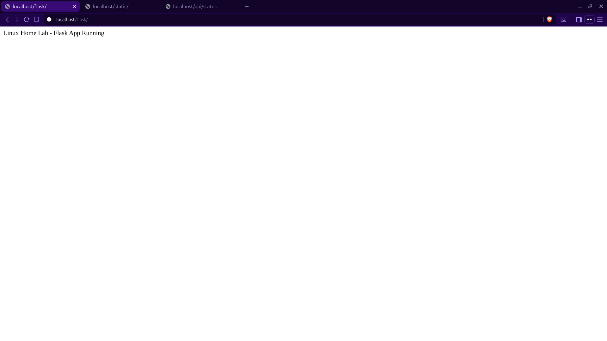
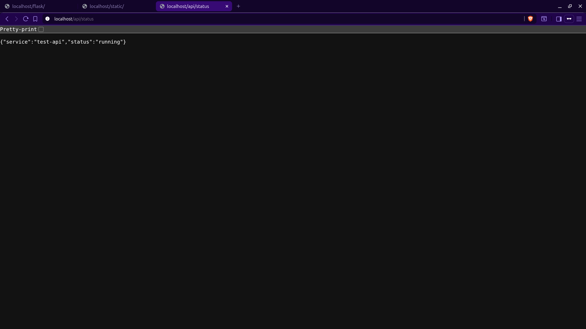
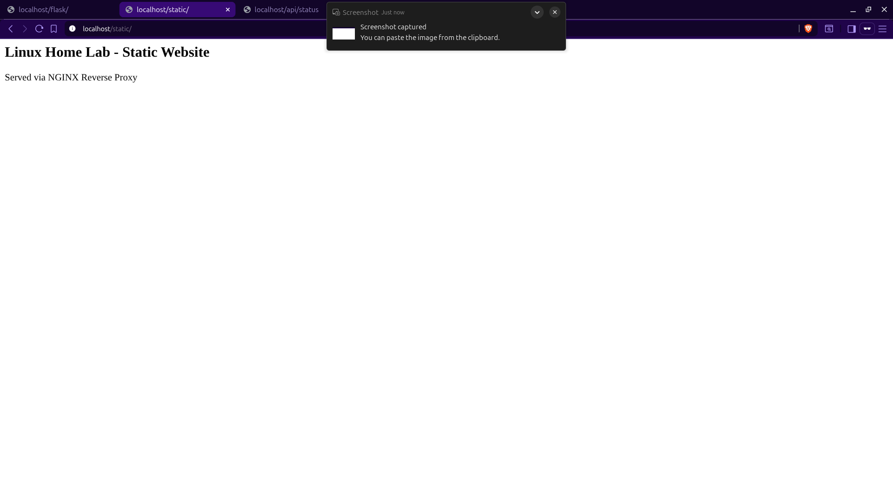
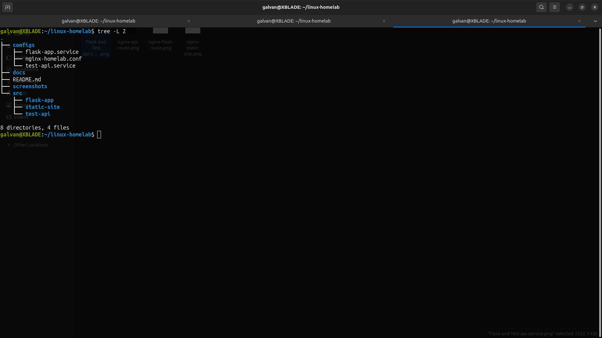

# Linux Home Lab — NGINX Reverse Proxy + systemd Services

A Linux-based lab environment hosting multiple applications under a single server using NGINX reverse proxy and systemd-managed services.

## Included Services

- Flask Web App (Service 1)
- Test API Service (Service 2)
- Static Website (Service 3)

All services are routed through NGINX under a single host.

## Reverse Proxy Routes

- /flask/ → Flask App (port 5000)
- /api/status → Test API (port 7000)
- /static/ → Static Website

## Infrastructure Concepts Practiced

- Linux environment setup & directory structure
- NGINX reverse proxy routing
- Python venv based isolation
- systemd service management
- process supervision & restart policy
- troubleshooting ports, permissions & routing
- basic deployment-style workflow

## Screenshots (to be added)

- Service routing via NGINX
- systemd service status
- directory structure
### NGINX Reverse Proxy Routes

### Project Structure

